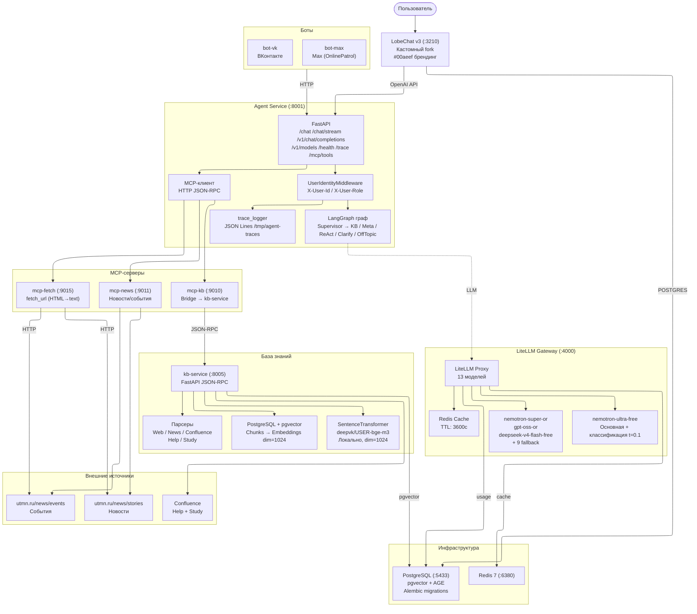

# Voproshalych v3 — Агент-ассистент ТюмГУ

Автономный AI-ассистент Тюменского государственного университета с собственной базой знаний,
LangGraph-оркестратором, MCP-инструментарием и кастомным чат-интерфейсом (LobeChat fork).

## Архитектура



### Компоненты

| Компонент | Технология | Порт | Описание |
|-----------|-----------|------|----------|
| **LobeChat v3** | lobehub/lobe-chat (fork) | 3210 | Кастомный чат-интерфейс: pixel cat логотип, #00aeef, consent screen, auth email+password |
| **agent-service** | FastAPI + LangGraph | 8001 | Оркестратор: классификация, маршрутизация, MCP-инструменты, трассировка |
| **LiteLLM Gateway** | LiteLLM Proxy | 4000 | Прокси к 14 LLM (OpenCode Zen + OpenRouter + Mistral) с fallback цепочками |
| **kb-service** | FastAPI + SQLAlchemy | 8005 | База знаний: парсинг, чанкинг, локальные эмбеддинги (deepvk/USER-bge-m3), pgvector-поиск |
| **mcp-kb** | Python FastMCP | 9010 | Bridge к kb-service через JSON-RPC |
| **mcp-news** | Python FastMCP | 9011 | Парсинг новостей и событий с utmn.ru |
| **mcp-fetch** | Python FastMCP | 9015 | Универсальный загрузчик URL (HTML → чистый текст) |
| **bot-vk** | Python | — | Бот для ВКонтакте |
| **bot-max** | Python | — | Бот для Max (OnlinePatrol) |
| **PostgreSQL** | PostgreSQL + pgvector + AGE | 5433 | Основная БД: документы, эмбеддинги, пользователи LobeChat |
| **Redis** | Redis 7 | 6380 | Кэш LiteLLM |

### Интенты (LangGraph)

```
start → supervisor (классификация интента через LLM)
          ├─ kb_qa          → kb_workflow (поиск по БЗ → LLM ответ)
          ├─ meta           → meta (ответ про ассистента)
          ├─ tool_required  → react (multi-tool агент через MCP)
          ├─ clarify        → clarify (уточнение запроса)
          └─ off_topic      → off_topic (вежливый отказ)
```

| Интент | Описание |
|--------|----------|
| `kb_qa` | Вопрос про университет (правила, стипендии, факультеты...) |
| `meta` | Вопрос про самого ассистента |
| `tool_required` | Запрос, требующий MCP-инструментов (новости, события, веб-страницы...) |
| `clarify` | Неясный запрос — просим уточнить |
| `off_topic` | Не по теме — вежливый отказ |

### LLM-модели (LiteLLM)

Основная модель — **nemotron-ultra-free** (Nvidia Nemotron 3 Ultra 550B, OpenCode Zen, бесплатно). При недоступности —
автоматический fallback через 12 моделей (OpenRouter free, ZEN free, Mistral Nemo). Классификация и генерация
используют первую доступную модель из приоритетного списка (`model_priority[0]`).
Эмбеддинги: локально deepvk/USER-bge-m3 (dim=1024) в kb-service.

### Аутентификация (LobeHub Server-mode + Better Auth)

- Регистрация по email+password (открытая, без подтверждения)
- AUTH_SECRET + KEY_VAULTS_SECRET в docker-compose
- Данные пользователей хранятся в PostgreSQL (таблицы Better Auth)
- X-User-Id / X-User-Role пробрасываются через middleware → Profile в AgentState

### Трассировка

- Каждый запрос получает `X-Request-Id` (UUID)
- Все узлы графа пишут `trace_logger.write_trace()` в JSON Lines файлы (`/tmp/agent-traces/traces-YYYYMMDD.jsonl`)
- Получить трассировку: `GET /trace?request_id=<uuid>`

## Быстрый старт

### 1. Подготовка

```bash
cd Submodules/voproshalych_v3
# Создать .env (пример в docs/Environment/v2_local/.env)
```

### 2. Запуск всех сервисов

```bash
docker compose up -d --build
```

Проверить статус:

```bash
docker compose ps
```

Health checks:

```bash
curl http://localhost:8001/health
# → {"status":"ok","service":"agent-service","version":"0.1.0"}

curl http://localhost:8005/health
# → {"status":"ok","service":"kb-service","version":"0.1.0"}

curl http://localhost:4000/health/readiness
# → {"status":"ok"}
```

### 2.5. Очистка базы знаний (опционально)

Если нужно перезаполнить базу знаний — удалить все чанки и эмбеддинги:

```bash
docker compose exec postgres psql -U voproshalych -d voproshalych \
  -c "TRUNCATE kb_embeddings CASCADE; TRUNCATE kb_chunks CASCADE;"
```

Или с хоста (через проброс порта 5433):

```bash
python scripts/clear_kb.py --db-host localhost --db-port 5433
```

### 3. Заполнение базы знаний

**Стандартные источники** (работают из Docker, логи в реальном времени):

Чтобы видеть подробный прогресс по каждому документу (парсинг → чанкинг → эмбеддинг → сохранение), откройте второй терминал и следите за логами:

```bash
docker compose logs -f kb-service
```

Затем в первом терминале выполните краулинг:

```bash
# Краулинг новостей
curl -X POST http://localhost:8005/api/v1/tools \
  -H "Content-Type: application/json" \
  -d '{"jsonrpc":"2.0","method":"crawl_utmn_news","params":{},"id":1}'

# Краулинг событий
curl -X POST http://localhost:8005/api/v1/tools \
  -H "Content-Type: application/json" \
  -d '{"jsonrpc":"2.0","method":"crawl_utmn_events","params":{},"id":1}'
```

**Confluence** (запускать с хоста):

```bash
uv run --no-project python3 scripts/crawl_confluence.py                # все пространства
uv run --no-project python3 scripts/crawl_confluence.py --source study  # только Study
uv run --no-project python3 scripts/crawl_confluence.py --source help   # только Help
```

**Проверить поиск:**

```bash
curl -X POST http://localhost:8005/api/v1/tools \
  -H "Content-Type: application/json" \
  -d '{"jsonrpc":"2.0","method":"kb_search","params":{"query":"какие стипендии в тюмгу","top_k":5},"id":1}'
```

### 4. Веб-интерфейс (LobeChat)

```
http://localhost:3210
```

При первом входе — consent screen (согласие на обработку данных).
Регистрация по email+password. После входа доступен чат с ассистентом.

### 5. API (OpenAI-совместимый)

```bash
# Список моделей
curl http://localhost:8001/v1/models

# Чат
curl -X POST http://localhost:8001/v1/chat/completions \
  -H "Content-Type: application/json" \
  -d '{
    "model": "voproshalych-v3",
    "messages": [{"role": "user", "content": "какие стипендии в тюмгу"}]
  }'
```

### Полезные команды

```bash
# Логи всех сервисов
docker compose logs -f

# Логи конкретного сервиса
docker compose logs -f agent-service kb-service lobe-chat

# Пересобрать и перезапустить
docker compose up -d --build <service>

# Остановить
docker compose down

# Остановить с удалением томов (стерёт БД!)
docker compose down -v
```

## Структура проекта

```
v3/
├── .env                        # Переменные окружения
├── docker-compose.yml          # Единый Compose (12 сервисов)
├── Makefile
│
├── kb-service/                 # База знаний
│   ├── Dockerfile              # python:3.12-slim-bookworm
│   └── src/kb/
│       ├── main.py             # FastAPI JSON-RPC
│       ├── config.py
│       ├── models.py           # KBChunk, KBEmbedding ORM
│       ├── db.py               # SQLAlchemy async engine
│       ├── embedding.py        # deepvk/USER-bge-m3 (SentenceTransformer)
│       ├── chunking.py         # Sentence-aware chunking
│       ├── search.py           # pgvector similarity search
│       ├── preprocessing.py
│       ├── tools.py            # crawl, search, store
│       └── parsers/            # web, news, confluence_help, confluence_study
│
├── agent-service/              # Оркестратор
│   ├── Dockerfile
│   └── src/
│       ├── main.py             # FastAPI + OpenAI API + /chat + /trace
│       ├── config.py           # MCP URLs, LLM params
│       ├── models.py           # AgentState, Intent, Complexity, Profile
│       ├── graph.py            # LangGraph: 5 узлов + supervisor
│       ├── middleware.py       # UserIdentityMiddleware
│       ├── trace_logger.py     # JSON Lines трассировка
│       ├── mcp_client.py      # HTTP JSON-RPC клиент
│       ├── streaming.py       # SSE стриминг
│       └── nodes/
│           ├── supervisor.py   # Классификация интентов
│           ├── kb_workflow.py  # Поиск по БЗ + LLM генерация
│           ├── meta.py         # Об ассистенте
│           └── react.py        # Multi-tool (MCP) агент
│
├── mcp-servers/                # MCP-серверы
│   ├── Dockerfile.kb           # mcp-kb bridge
│   ├── Dockerfile.public       # Все публичные MCP
│   └── src/
│       ├── kb/
│       │   ├── server.py       # mcp-kb: tools/list, tools/call
│       │   └── qa_client.py    # HTTP-клиент kb-service
│       └── public/
│           ├── server.py       # Диспетчер server_type
│           ├── news_server.py  # Новости + события
│           ├── fetch_server.py # fetch_url (HTML→text)
│           ├── contacts_server.py
│           ├── library_server.py
│           └── sveden_server.py
│
├── lobe-chat/                  # Кастомный LobeChat fork
│   ├── Dockerfile              # Многостадийная сборка + assets
│   ├── custom.js               # #00aeef брендинг, скрытие UI
│   └── consent.html            # Экран согласия на обработку данных
│
├── assets/                     # Брендовые ресурсы
│   ├── logo.svg                # Pixel cat логотип (горизонтальный)
│   ├── logo-icon.svg           # Pixel cat иконка
│   ├── icon-192x192.png
│   ├── icon-192x192.maskable.png
│   ├── icon-512x512.png
│   └── icon-512x512.maskable.png
│
├── db/                         # База данных
│   ├── Dockerfile              # Alembic миграции
│   ├── alembic.ini
│   ├── migration/
│   └── postgres/
│       ├── Dockerfile          # PostgreSQL + pgvector + AGE
│       └── init.sql
│
├── litellm/
│   └── config.yaml             # 13 моделей + fallback chains + Redis
│
├── bot-vk/                     # Бот ВКонтакте
├── bot-max/                    # Бот Max (OnlinePatrol)
│
└── scripts/
    ├── test.sh
    ├── test_curl.sh
    ├── crawl_confluence.py       # Confluence-парсер (с хоста)
    └── export_graph_mermaid.py   # Генерация Mermaid-диаграммы графа LangGraph
```

## Конфигурация

Основные переменные `.env`:

| Переменная | По умолчанию | Описание |
|-----------|-------------|----------|
| `ZEN_API_KEY` | — | API-ключ OpenCode Zen (основной, обязательно) |
| `MISTRAL_API_KEY` | — | API-ключ Mistral (резерв) |
| `OPENROUTER_API_KEY` | — | API-ключ OpenRouter (резервные модели) |
| `LITELLM_MASTER_KEY` | `sk-litellm-master-key-v3` | Мастер-ключ LiteLLM |
| `AUTH_SECRET` | `changeme-auth-secret-v3` | Secret для JWT LobeChat |
| `KEY_VAULTS_SECRET` | `changeme-dev-secret-v3` | Secret для шифрования ключей LobeChat |
| `POSTGRES_DB` | `voproshalych` | Имя БД |
| `POSTGRES_USER` | `voproshalych` | Пользователь БД |
| `POSTGRES_PASSWORD` | `voproshalych` | Пароль БД |

## Порты сервисов

| Сервис | Хост | Контейнер |
|--------|------|-----------|
| LobeChat | 3210 | 3210 |
| agent-service | 8001 | 8001 |
| LiteLLM | 4000 | 4000 |
| kb-service | 8005 | 8004 |
| PostgreSQL | 5433 | 5432 |
| Redis | 6380 | 6379 |
| mcp-kb | 9010 | 9010 |
| mcp-news | 9011 | 9011 |
| mcp-fetch | 9015 | 9015 |

## Тестирование

```bash
# Unit-тесты
make test-unit
# или
bash scripts/test.sh

# Curl-тесты (health, MCP, LiteLLM, chat)
make test-curl

# Unit-тесты по модулям
cd kb-service && uv run pytest -q    # 17 тестов
cd mcp-servers && uv run pytest -q   # 17 тестов
cd agent-service && uv run pytest -q  # 29 тестов
```

## Граф агента (LangGraph)

Сгенерировать Mermaid-диаграмму текущего графа агента (узлы, рёбра, условный
роутинг) — скрипт читает `agent-service/src/graph.py` и экспортирует структуру
графа в формате Mermaid:

```bash
cd agent-service && uv run python ../scripts/export_graph_mermaid.py
```

Результат: `docs/AGENT_GRAPH.mmd` — можно открыть в mermaid.live или VS Code
(плагин Mermaid).

## Сети

| Сеть | Тип | Описание |
|------|-----|----------|
| `v3-net` | bridge | Внутренняя сеть v3 |

## Планы

- [x] Брендинг LobeChat (pixel cat логотип, #00aeef, custom.js, consent screen)
- [x] Аутентификация (LobeHub server-mode + Better Auth, email+password)
- [x] Трассировка запросов (trace_logger, GET /trace)
- [x] MCP-сервер fetch_url
- [x] Локальные эмбеддинги (deepvk/USER-bge-m3)
- [ ] Multi-tenant workspace (applicant, student, staff)
- [ ] MCP-серверы персональных данных (Modeus, LMS, Email)
- [ ] Метрики и мониторинг (Prometheus + Grafana)
